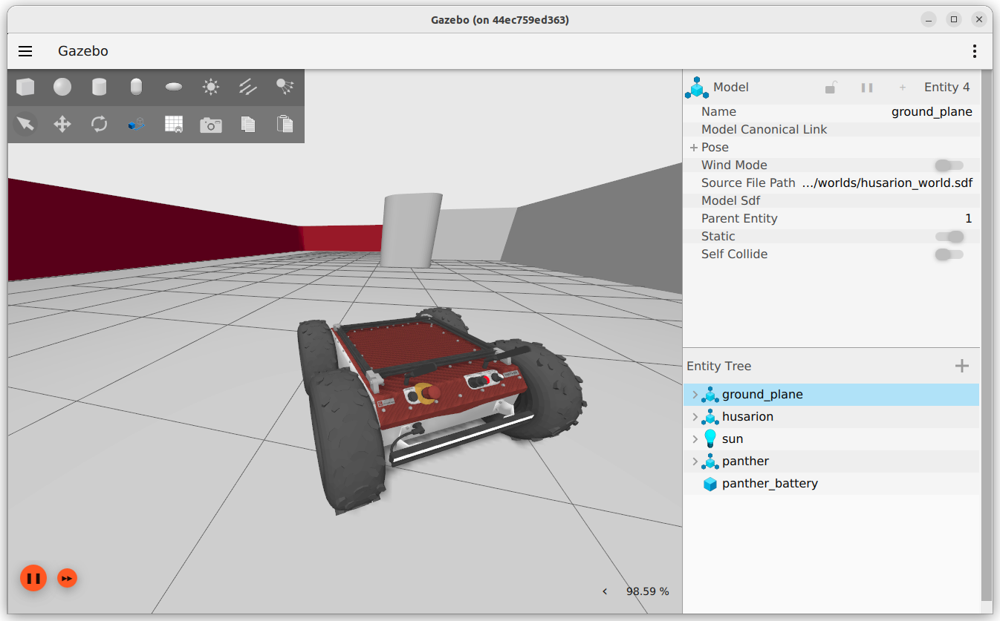

# panther-gazebo-ros2

## Quick Start

edit the `.env` file and select `runc` (works always)  or `nvidia` (works faster) Docker runtime:

```bash
# =======================================
# Docker config
# =======================================

# CPU only config
DOCKER_RUNTIME=runc
LIBGL_ALWAYS_SOFTWARE=1

# # GPU config
# DOCKER_RUNTIME=nvidia
# LIBGL_ALWAYS_SOFTWARE=0
```

Open a new terminal window and run:

```bash
xhost +
docker compose up
```

In the separate terminal window run:

```bash
ros2 run teleop_twist_keyboard teleop_twist_keyboard
```

to control the robot

